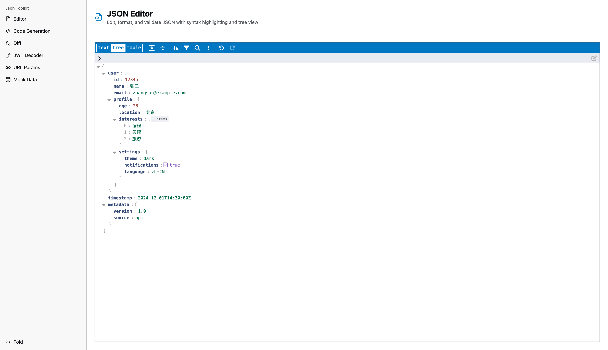
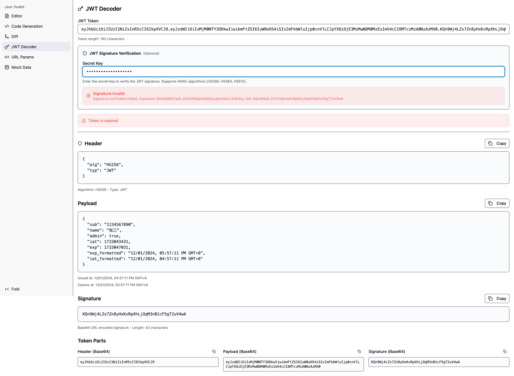
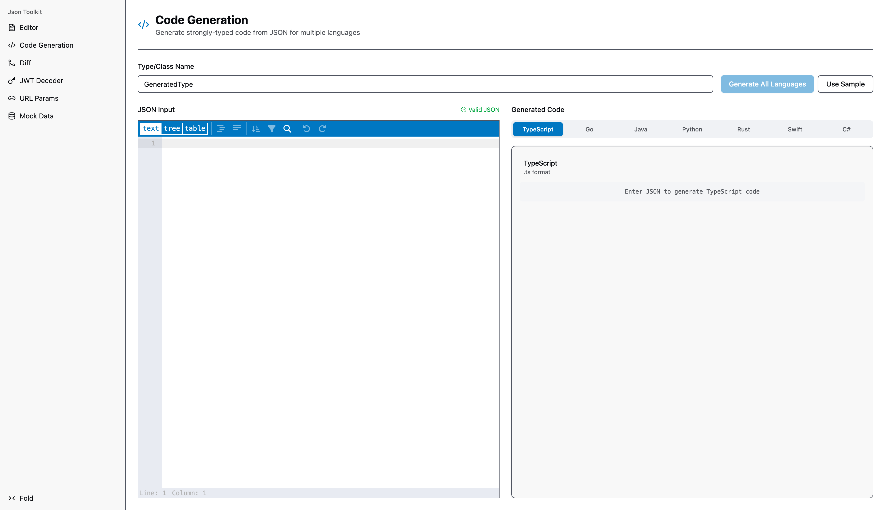
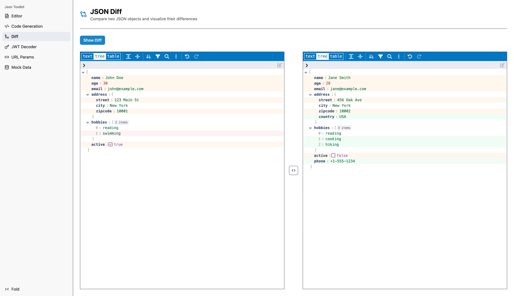
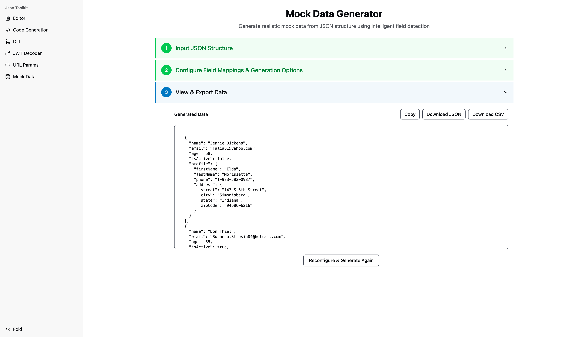
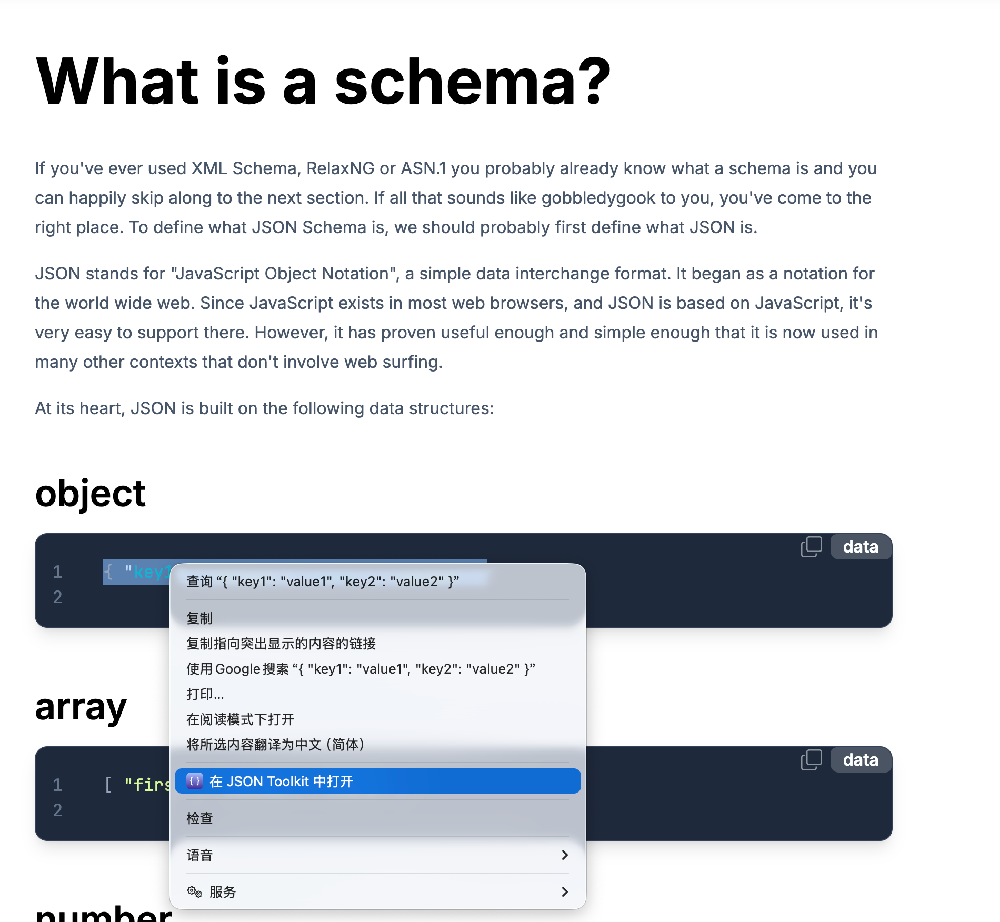
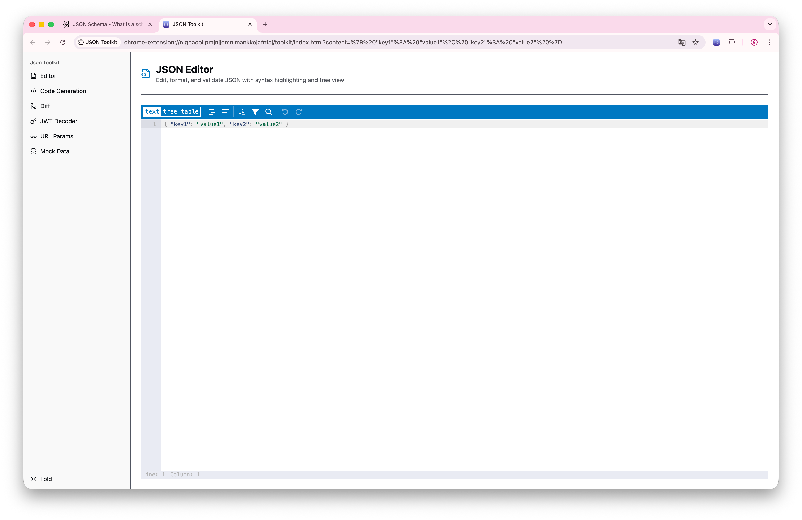

# JSON Toolkit - 专业的 JSON 处理工具套件

<div align="center">


**强大的 JSON 编辑器和工具集合，让 JSON 处理变得简单高效**

[](https://github.com/ison-toolkit/json-toolkit)
[](https://chrome.google.com/webstore)
[](https://addons.mozilla.org/)

</div>

## ✨ 功能特点

JSON Toolkit 是一个功能齐全的 JSON 处理工具套件，专为开发者和数据处理专业人员设计。提供强大的 JSON 编辑、验证、转换和生成功能，让您的数据处理工作流程更加高效。

### 🔧 核心功能

#### 📝 智能 JSON 编辑器
- **多视图模式**: 支持文本、树形和表格三种视图切换
- **语法高亮**: 智能语法高亮和实时错误提示
- **格式化工具**: 一键格式化、压缩和排序 JSON 数据
- **搜索功能**: 支持正则表达式的强大搜索和替换
- **撤销/重做**: 完整的操作历史记录，防止误操作



#### 🔐 JWT 令牌解码器
- **完整解析**: 自动解析 Header、Payload 和 Signature
- **签名验证**: 支持 HMAC 算法 (HS256, HS384, HS512) 验证
- **到期时间检查**: 自动检测令牌是否过期，直观显示有效期
- **可视化展示**: 清晰的 JSON 格式展示各部分内容



#### ⚡ 代码生成器
- **多语言支持**: 支持 TypeScript、Go、Java、Python、Rust、Swift、C# 等主流语言
- **类型安全**: 智能分析 JSON 结构，生成强类型代码定义
- **自定义配置**: 可自定义生成的类型/类名称及语言特定选项
- **即时预览**: 实时预览生成的代码，所见即所得



#### 🔄 JSON 差异对比
- **并排对比**: 直观的左右并排差异视图
- **高亮显示**: 清晰标识添加、删除和修改的内容
- **交换功能**: 一键交换左右对比内容，方便双向比对



#### 🎲 智能 Mock 数据生成器
- **智能字段识别**: 自动识别字段名（如 email, phone），匹配相应的数据生成器
- **丰富的数据类型**: 内置姓名、邮箱、电话、地址等多种真实数据类型
- **批量生成**: 可灵活配置生成数量和随机种子
- **多格式导出**: 支持 JSON 和 CSV 格式导出



#### 🔧 URL 参数转换器
- **双向转换**: URL 参数 (Query String) 与 JSON 对象间的无缝转换
- **编码处理**: 自动处理 URL 编码和解码
- **格式化输出**: 转换结果自动美化，易于阅读

### 🌐 浏览器集成

JSON Toolkit 提供深度的浏览器集成，让您在浏览网页时能够无缝处理 JSON 数据：

#### 📋 右键上下文菜单
- **智能识别**: 自动识别选中的文本是否为 JSON 或类 JSON 内容
- **一键打开**: 右键选择 "在 JSON Toolkit 中打开"，直接处理选中文本
- **无缝切换**: 从网页内容直接跳转到工具界面，无需手动复制粘贴



#### 🔧 智能 JSON 修复
- **自动修复**: 智能修复常见的 JSON 格式错误
- **支持多种格式**: 兼容 JavaScript 对象字面量、单引号、尾随逗号等非标准 JSON
- **修复反馈**: 清晰显示修复过程和结果



## 🚀 快速开始

### 浏览器扩展安装

> **注意**: 扩展将在 v1.0 正式发布后上架 Chrome Web Store 和 Firefox Add-ons，目前可以通过开发模式本地安装。

#### Chrome/Edge 安装
1. 下载最新版本的扩展文件
2. 打开 Chrome 扩展管理页面 (`chrome://extensions/`)
3. 开启右上角的 "开发者模式"
4. 点击 "加载已解压的扩展程序"，选择扩展文件夹

#### Firefox 安装
1. 下载最新版本的扩展文件
2. 打开 Firefox 插件管理页面 (`about:addons`)
3. 点击设置图标，选择 "从文件安装插件"
4. 选择扩展的 `.zip` 文件或文件夹

### 本地开发

如果您想要本地运行或进行二次开发：

```bash
# 克隆仓库
git clone https://github.com/ison-toolkit/json-toolkit.git
cd json-toolkit

# 安装依赖
bun install

# 启动 Web 应用开发服务器
bun run toolkit:dev

# 构建浏览器扩展
bun run ext:build:chrome    # Chrome 版本
bun run ext:build:firefox   # Firefox 版本

# 构建所有
bun run toolkit:build:extension
```

## 🎯 使用场景

- **API 开发**: 快速验证 API 响应格式，调试接口数据
- **调试工作**: 解析 JWT 令牌，查看 Payload 信息
- **数据转换**: 在 URL 参数和 JSON 之间快速转换
- **模拟测试**: 快速生成用于前端测试的 Mock 数据
- **代码生成**: 从 JSON 响应自动生成 TypeScript 接口或 Go 结构体
- **文档编写**: 比较不同版本的 JSON 结构差异

## 🏗️ 技术栈

- **前端框架**: React 19 + TypeScript
- **JSON 编辑器**: vanilla-jsoneditor
- **UI 组件**: Radix UI + Tailwind CSS
- **浏览器扩展**: WXT Framework
- **构建工具**: Vite + Bun
- **代码生成**: quicktype-core
- **Mock 数据**: Faker.js


## 🙏 致谢

- 本项目图标由 [Ray.so](https://ray.so/) 生成

## 📄 许可证

本项目采用 MIT 许可证，详见 [LICENSE](LICENSE) 文件。

## 🤝 贡献

欢迎提交 Issue 和 Pull Request 来帮助改善这个项目！

## 📞 反馈与支持

如果您在使用过程中遇到问题或有建议，请：

- 提交 [GitHub Issue](https://github.com/ison-toolkit/json-toolkit/issues)

---

<div align="center">

**让 JSON 处理变得简单高效 | Made with ❤️ for developers**

</div>
