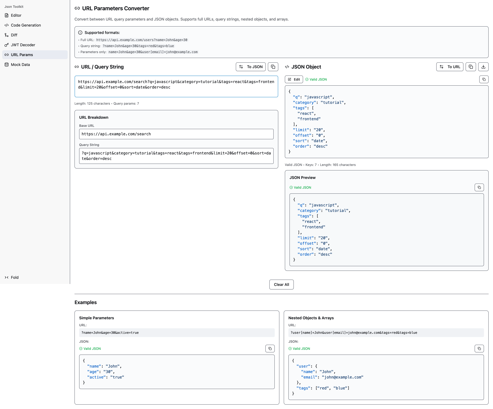

# JSON Toolkit - Professional JSON Processing Suite

[English](README.md) | [中文](README_ZH.md)

<div align="center">


**Powerful JSON editor and tool collection to make JSON processing simple and efficient**

[](https://github.com/ison-toolkit/json-toolkit)
[](https://chromewebstore.google.com/detail/json-toolkit/pijknamcljeplklkhmpiakbaphmlhaig)
[](https://addons.mozilla.org/en-US/firefox/addon/json-toolkit/)

</div>

## ✨ Features

JSON Toolkit is a fully featured JSON processing suite designed for developers and data processing professionals. It provides powerful JSON editing, validation, conversion, and generation capabilities to make your data processing workflow more efficient.

### 🔧 Core Features

#### 📝 Smart JSON Editor
- **Multi-view Mode**: Support for Text, Tree, and Table view switching
- **Syntax Highlighting**: Smart syntax highlighting and real-time error indication
- **Formatting Tools**: One-click format, minify, and sort JSON data
- **Search**: Powerful search and replace with Regex support
- **Undo/Redo**: Complete operation history to prevent mistakes


#### 🔐 JWT Decoder
- **Full Parsing**: Automatically parse Header, Payload, and Signature
- **Signature Verification**: Support for HMAC algorithms (HS256, HS384, HS512)
- **Expiration Check**: Auto-detect token expiration with visual validity display
- **Visual Display**: Clear JSON formatted display of all parts


#### ⚡ Code Generator
- **Multi-language Support**: Support for TypeScript, Go, Java, Python, Rust, Swift, C#, and more
- **Type Safety**: Smart analysis of JSON structure to generate strong type definitions
- **Custom Configuration**: Customizable class/type names and language-specific options
- **Instant Preview**: Real-time preview of generated code


#### 🔄 JSON Diff
- **Side-by-side Comparison**: Intuitive side-by-side difference view
- **Highlighting**: Clear indication of added, removed, and modified content
- **Swap**: One-click swap of left/right content for bidirectional comparison


#### 🎲 Smart Mock Data Generator
- **Smart Field Recognition**: Automatically recognize field names (e.g., email, phone) to match appropriate generators
- **Rich Data Types**: Built-in real-world data types like Name, Email, Phone, Address, etc.
- **Batch Generation**: Flexible configuration for generation count and random seed
- **Multi-format Export**: Support for JSON and CSV export


#### 🔧 URL Params Converter
- **Bi-directional Conversion**: Seamless conversion between URL Query String and JSON objects
- **Encoding Handling**: Automatic handling of URL encoding and decoding
- **Formatted Output**: Beautifully formatted results for easy reading



### 🌐 Browser Integration

JSON Toolkit provides deep browser integration, allowing you to process JSON data seamlessly while browsing:

#### 📋 Context Menu
- **Smart Recognition**: Automatically detect if selected text is JSON or JSON-like
- **One-click Open**: Right-click "Open in JSON Toolkit" to process selected text directly
- **Seamless Switch**: Jump directly from web content to the tool interface without manual copy-pasting


#### 🔧 Smart JSON Repair
- **Auto Repair**: Intelligently fix common JSON format errors
- **Multi-format Support**: Compatible with JS object literals, single quotes, trailing commas, etc.
- **Repair Feedback**: Clear display of the repair process and results


## 🚀 Quick Start

### Extension Installation

You can install directly from the stores:

- [**Chrome Web Store**](https://chromewebstore.google.com/detail/json-toolkit/pijknamcljeplklkhmpiakbaphmlhaig)
- [**Firefox Add-ons**](https://addons.mozilla.org/en-US/firefox/addon/json-toolkit/)

Or install locally via developer mode:

#### Chrome/Edge Installation
1. Download the latest extension files
2. Open Chrome Extensions page (`chrome://extensions/`)
3. Enable "Developer mode" in the top right
4. Click "Load unpacked" and select the extension directory

#### Firefox Installation
1. Download the latest extension files
2. Open Firefox Add-ons page (`about:addons`)
3. Click the settings icon and select "Install Add-on From File"
4. Select the extension `.zip` file or directory

### Local Development

If you want to run locally or contribute:

```bash
# Clone repository
git clone https://github.com/ison-toolkit/json-toolkit.git
cd json-toolkit

# Install dependencies
bun install

# Start Web App dev server
bun run toolkit:dev

# Build browser extension
bun run ext:build:chrome    # Chrome version
bun run ext:build:firefox   # Firefox version

# Build all
bun run toolkit:build:extension
```

## 🎯 Use Cases

- **API Development**: Quickly verify API response formats and debug interface data
- **Debugging**: Parse JWT tokens to view payload information
- **Data Conversion**: Fast conversion between URL parameters and JSON
- **Mock Testing**: Rapidly generate Mock data for frontend testing
- **Code Generation**: Automatically generate TypeScript interfaces or Go structs from JSON responses
- **Documentation**: Compare differences between JSON structure versions

## 🏗️ Tech Stack

- **Frontend Framework**: React 19 + TypeScript
- **JSON Editor**: vanilla-jsoneditor
- **UI Components**: Radix UI + Tailwind CSS
- **Browser Extension**: WXT Framework
- **Build Tools**: Vite + Bun
- **Code Generation**: quicktype-core
- **Mock Data**: Faker.js

## 🙏 Acknowledgements

- Project icon generated by [Ray.so](https://ray.so/)

## 📄 License

This project is licensed under the MIT License - see the [LICENSE](LICENSE) file for details.

## 🤝 Contribution

Issues and Pull Requests are welcome to help improve this project!

## 📞 Feedback & Support

If you encounter any issues or have suggestions, please:

- Submit a [GitHub Issue](https://github.com/ison-toolkit/json-toolkit/issues)

---

<div align="center">

**Making JSON processing simple and efficient | Made with ❤️ for developers**

</div>
